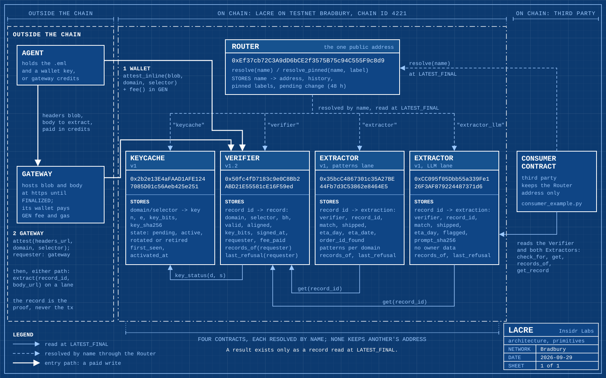

# Lacre

Lacre: a signed-evidence primitive for GenLayer. By Insidr Labs, MIT license.

Lacre is signed evidence for Intelligent Contracts on GenLayer. An email that
a domain has DKIM-signed is already a statement that domain will stand behind:
the signature covers the headers, the public key is published in DNS, and
anyone can check it. Lacre puts that check inside a contract. Validators read
the signed headers, take the sender's key from the KeyCache, where it was
recorded from DNS by validator consensus, verify the RSA signature
independently, and agree on a small record: the signing domain, the selector,
the body hash the signature claimed, a SHA-256 of the Message-ID, the key
size, the verdict and a reason. Other contracts and agents read that record.
No message body reaches calldata or storage, and storage holds only the
record: no address, To or Subject, and of the From header only its domain.
Calldata is public: `attest_inline` puts every header in the blob in calldata
permanently, and `attest` puts the blob's URL there, so anyone can fetch the
headers while they are served. The Verifier checks the headers only; the
Extractor checks a body against the `bh` of a Verifier record and reads a few
fields out of it. See [docs/interfaces.md](docs/interfaces.md), sections 6
and 10.

## Primitives

Five contracts on Testnet Bradbury, each usable on its own from a wallet or
from another contract. The Router is the one address to remember; it
resolves the other four by name. How to call them without the gateway is in
[docs/direct-use.md](docs/direct-use.md).

| contract | version | Bradbury address | purpose |
|----------|---------|------------------|---------|
| [Router](docs/router.md) | - | `0xEf37cb72C3A9dD6bCE2f3575B75c94C555F9c8d9` | resolves `verifier`, `keycache`, `extractor` and `extractor_llm`, with a 48 hour notice on any change |
| [KeyCache](docs/keycache.md) | v1 | `0x2b2e13E4aFAAD1AFE1247085D01c56Aeb425e251` | holds DKIM keys read from DNS by consensus, usable after a 24 hour quarantine |
| [Verifier](docs/verifier.md) | v1.2 | `0x50fc4fD7183c9e0C8Bb2ABD21E55581cE16F59ed` | turns the DKIM signature of a set of headers into a public record |
| [Extractor (patterns)](docs/extractor.md) | v1 | `0x35bcC4867301c35A27BE44Fb7d3C53862e8464E5` | checks a body against a Verifier record and reads it with the sender's patterns |
| [Extractor (LLM)](docs/llmextractor.md) | v1 | `0xCC095f05Dbb55a339Fe126F3AF879224487371d6` | the same body check, read by each validator's model, for any sender |

The Router in front of the four contracts it resolves, the two ways an agent
attests, and a consumer contract reading through the Router.

## What is here

The repository holds three things. The DKIM probes are the evidence that the
check itself works. `experiments/dkim-probe/` is the off-chain verifier: pure
Python RFC 6376, no third party crypto, with its test suite and a tool that
cuts the minimum blob a signature can be checked from. Next to it,
`experiments/dkim-onchain-probe/` is the same verifier reduced to fit a
contract, with the numbers measured on Testnet Bradbury: a 14 649 byte
contract deployed for 11 580 459 gas, an attestation costing about 0.9 M gas
and reaching consensus in 13 to 27 seconds with 5 of 5 validators agreeing,
and a live 1024 bit RSA signature from a large sender verified on chain. It
also records what does not work: validators refuse a plain HTTP URL to a raw
IP before the request leaves the node. A third, `experiments/dkim-body-probe/`,
binds the body served at a URL to the body hash the same signature already
committed to and parses fields out of it with no RSA on chain. The value
probes, `experiments/value-probe/` and `experiments/value-probe-2/`, answer
whether a contract can be paid in GEN and pay out again: it can, as long as
the payout uses the external message path and settles on finalization, because
the internal message path moves zero wei to a wallet and reports no error.

The production layer on Bradbury was redeployed on 2026-09-26. Its public
address is the Router in `contracts/router/`, at
`0xEf37cb72C3A9dD6bCE2f3575B75c94C555F9c8d9`, which resolves `verifier`,
`keycache`, `extractor` and `extractor_llm` to the current contracts and puts a 48 hour delay
on any later change. The KeyCache in `contracts/keycache/`, at
`0x2b2e13E4aFAAD1AFE1247085D01c56Aeb425e251`, holds the DKIM keys and makes
each new one wait out a 24 hour quarantine before it can be used; the
amazon.com key was registered there on 2026-09-26 and has been active since
`confirm_key` on 2026-09-27. Verifier v1.2 in `contracts/verifier/`, at
`0x50fc4fD7183c9e0C8Bb2ABD21E55581cE16F59ed`, turns a DKIM signature into the
record described above, reads its keys from the KeyCache through the Router,
and only attests against an active key. The pattern Extractor in
`contracts/extractor/`, at `0x35bcC4867301c35A27BE44Fb7d3C53862e8464E5`,
deployed on 2026-09-28 and resolved by the Router as `extractor`, takes a
Verifier record and the URL of the message body, checks the body against the
record's `bh`, and stores what the sender's patterns read in it: whether it
shipped, the weekday it arrives, a date when the text carries one, and
whether an order number is present, never the number itself. See
[docs/extractor.md](docs/extractor.md). A second lane for senders with no
patterns, the LLM Extractor in `contracts/llmextractor/`, at
`0xCC095f05Dbb55a339Fe126F3AF879224487371d6`, deployed on 2026-09-28 and
resolved by the Router as `extractor_llm`, has each validator's model read
the same body through the prompt probe D2 measured and stores whether it
shipped and the weekday it arrives. See
[docs/llmextractor.md](docs/llmextractor.md).

The previous versions stay live. Registry v1, at
`0x1E1380B71F1C9c622C432B6FD6fa56097B1E4Ddc`, holds the amazon.com key and
still points at Verifier v1.1, at
`0x9821cfa5fe33a24f9d1D3Cca15885f1a2781EA1d`, where refused calls were
measured to answer and refund in full at finalization. Registry v0, at
`0xd9C6a6A0942490880BfF1405d8746AFC3e55d85e`, is retired and nothing points
at it. Verifier v1, at `0x74AfE3a7E6D2601bdC9BCC6265d8314F1a74807a`, is
retired because it reverted on an underpaid call, and a reverting call on
this chain keeps the value it carried. Every address and deploy transaction
is in [docs/interfaces.md](docs/interfaces.md), section 2. See also
[docs/router.md](docs/router.md), [docs/keycache.md](docs/keycache.md),
[docs/verifier.md](docs/verifier.md), [docs/registry.md](docs/registry.md),
[experiments/dkim-onchain-probe/README.md](experiments/dkim-onchain-probe/README.md)
and
[experiments/value-probe-2/README.md](experiments/value-probe-2/README.md).

The interface of every layer, for integrators and reviewers, is in [docs/interfaces.md](docs/interfaces.md).

## Tools

`tools/` holds the production scripts: `deploy.py`, `call.py`, `read.py`,
which needs no key, and `attest.py`, the reference client for the Verifier.
`attest.py` finds Verifier v1.2 and the KeyCache through the Router, does not
send a call for a key that is not active, and confirms the outcome through
the Verifier's `records_of` and `last_refusal` views. It exits 0 only once
the attesting transaction is FINALIZED with an
AGREE result and FINISHED_WITH_RETURN, and the record has been read back at
`LATEST_FINAL` with the sender as its requester. A refusal is reported with
its reason and not sent again. A transaction that finalized without
executing, whose value the protocol refunds, is sent again as a new one, up
to `--attempts`; anything it cannot judge, such as an appeal in progress or
a failed read, stops it with the consensus tx id and nothing more is sent.
Each outcome has its own exit code, listed in the script. The rules it
follows are in [docs/interfaces.md](docs/interfaces.md), section 5.

`tools/headers_blob.py` cuts the headers blob `attest_inline` takes from an
.eml kept in a gitignored directory, and prints it, or with `--digest` only
its length and SHA-256. `integrations/consumer_example.py` is a minimal
contract that reads the Verifier and the Extractors through the Router, for
a third party to copy; it is not deployed. Both are described in
[docs/direct-use.md](docs/direct-use.md).

Using it: the primitives can be used from any wallet on Bradbury or from a
contract. There is also a hosted way in at `https://lacre.in-sidr.xyz`, a
gateway that takes an .eml by upload, by mail to a mailbox it creates, or
through MCP, pays the fee and the gas itself and charges credits for it.
The same page lets a wallet sign `attest_inline` itself, and offers a
DKIM-signed gmail.com sample so a reviewer needs no message of their own.

Status: research probes plus the Router, the KeyCache, the Verifier and
both extraction lanes, the pattern Extractor and the LLM Extractor, on a
testnet, with the previous Registry and Verifier still live beside them.
The amazon.com key and the gmail.com key (selector 20251104) are active on
the KeyCache. Verifier v1.2 holds seven records, ids 0 to 6, the first
written on 2026-09-27 and all finalized. Record 3 was written on 2026-09-30
by `attest_inline` sent straight from a wallet, with the wallet as
requester and fee 0, and finalized. The sender paid about 0.0002 GEN of L2
gas (1 452 288 gas); the explorer shows the whole consensus round at 15 L2
transactions, 9 557 999 gas and 0.00089557 GEN. Record 4 was written the
same day through the hosted gateway, for a gmail.com message received in a
mailbox; record 5, on the same day, was the sample the page offers,
attested from a wallet; record 6 was another gmail.com message attested
inline from a wallet on 2026-10-02. The Extractor is
deployed with the amazon.com patterns set, and holds its first record that
matched a signed body, record 2, written against that Verifier record on
2026-09-28 and finalized; records 0 and 1 before it are charged records of a
body URL that answered 404. The LLM Extractor holds its first record, record
0, written against the same Verifier record on 2026-09-28 and finalized,
with the same reading from the same body: shipped, arriving miercoles.
